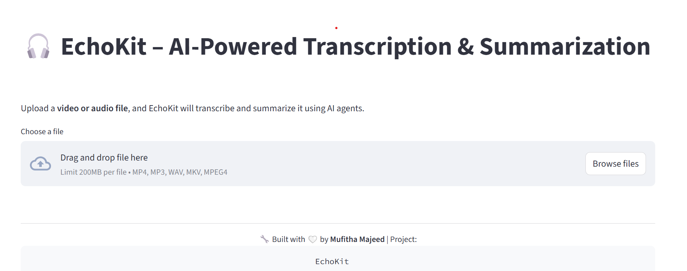
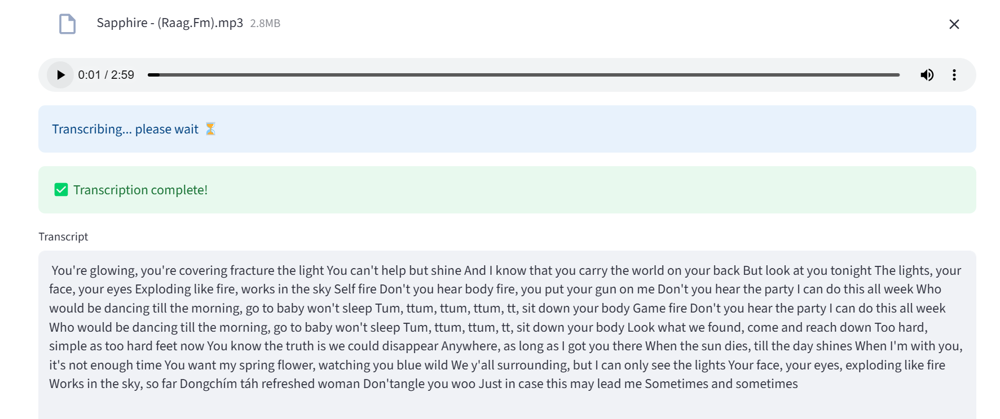

# 🎧 EchoKit – AI-Powered Transcription & Summarization Toolkit

**EchoKit** is a lightweight, open-source developer tool that transcribes and summarizes audio/video content using open-source AI models. Built with Streamlit, Whisper, and Hugging Face Transformers, it’s perfect for students, researchers, creators, and anyone who wants quick insights from spoken content.

<p align="center">
  
  
  
</p>

---

## 🔍 Features

*  Whisper-based transcription (fully offline using `openai-whisper`)
*  Summarization using `facebook/bart-large-cnn`
*  Transcript + 🔎 Summary display
*  Download buttons for saving `.txt` files
*  Clean Streamlit layout with colored sections
*  No API keys or billing needed – 100% open source

---

## 📂 Project Structure

```
echokit/
├── app.py
├── requirements.txt
├── README.md
├── utils/
│   ├── transcriber.py
│   └── summarizer.py
├── data/
└── output/
```

---

## 🚀 Getting Started Locally

### 1. Clone the repository

```bash
git clone https://github.com/yourusername/echokit.git
cd echokit
```

### 2. Create a virtual environment (optional but recommended)

```bash
python -m venv venv
.\venv\Scripts\activate        # Windows
# or
source venv/bin/activate       # macOS/Linux
```

### 3. Install dependencies

```bash
pip install -r requirements.txt
```

### 4. Make sure FFmpeg is installed

Whisper requires [FFmpeg](https://ffmpeg.org/download.html).
Add FFmpeg’s `/bin` directory to your system `PATH`.

### 5. Run the app

```bash
streamlit run app.py
```

Then open `http://localhost:xxxx` in your browser.

---

## 🌐 Try It Online

> [Run on Hugging Face Spaces](https://huggingface.co/spaces/mufithamajeed/echokit)

---

## 🖼️ Screenshots






---

## 🧠 Models Used

* [`openai/whisper`](https://github.com/openai/whisper) (Transcription)
* [`facebook/bart-large-cnn`](https://huggingface.co/facebook/bart-large-cnn) (Summarization)

---

## 👤 Author

**Mufitha Majeed**  
[GitHub](https://github.com/mufithamajeed)  

---

## 📄 License

This project is licensed under the MIT License. See `LICENSE` for details.
